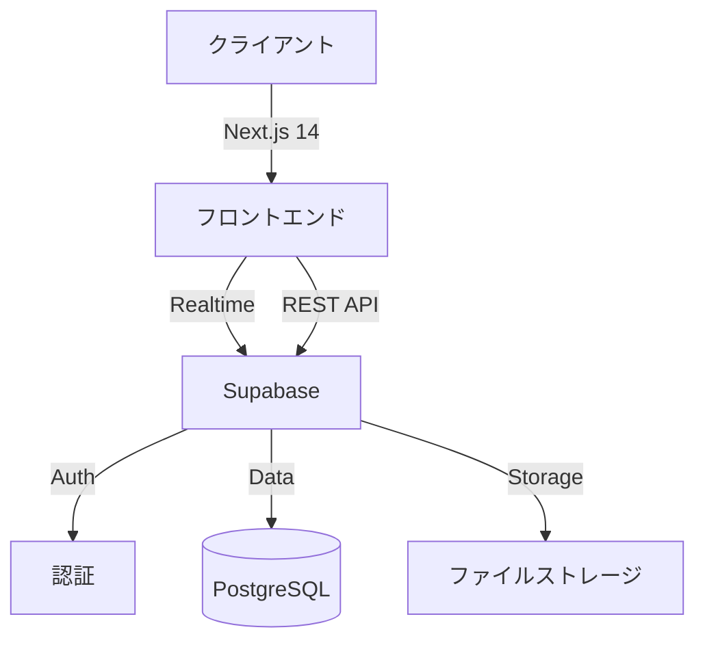

# ラーメンブログ

地域から全国のラーメン店舗やスポット情報を管理・共有できるブログシステムです。管理者が地域の店舗情報や写真を投稿し、カテゴリー別に整理して閲覧できる、シンプルで使いやすい情報共有プラットフォームを目指しています。

## 主な機能

### 1. 記事管理システム

- 都道府県、ラーメンの種類、年代などからカテゴリ分け
- カバー画像のアップロード機能
- 直感的な記事の編集・削除インターフェース

### 2. カテゴリーベースの記事管理

- 複数カテゴリーでの記事分類が可能
- フォルダーベースのカテゴリー管理

### 3. レスポンシブデザイン

- モバイルからデスクトップまで、様々な画面サイズに対応
- Tailwind CSSを活用した一貫性のあるUI設計
- モバイル最適化されたフィルター機能

  

## 使用技術

#### システム構成図

### フロントエンド

- Next.js 14（App Router採用）
  - Server Components
  - Client Components
  - Server Actions
- TypeScript
- Tailwind CSS
- FontAwesome
- DOMPurify（XSS対策）

### バックエンド

- Supabase
  - PostgreSQL（データベース）
  - Authentication（認証基盤）
  - Storage（画像ストレージ）

### インフラストラクチャ

- Vercel

## 開発情報

- 開発体制：個人開発
- 開発期間：2024年12月〜2025年2月(20時間)

## 工夫した点

### 1. ユーザビリティ

- カテゴリーフィルターのインタラクティブな操作性
- 記事がないカテゴリーの視覚的な表示
- ローディング状態の適切な表示
- モバイル・デスクトップ両対応のフィルター UI

### 2. パフォーマンス

- Next.js Image componentを活用した画像の最適化
- 効率的なデータ取得と状態管理

## 今後の展望

### 1. 機能拡張

- 年代ごとのbestラーメンランキングの実装
- タイトルや本文でのフォント変更
- 地図との連携機能
- 投稿記事一覧のページのUI/UXの強化

### 2. 技術的改善

- テストカバレッジの向上
- エラーハンドリングの強化
- SEO対策の実装
- パフォーマンスの最適化

このアプリケーションは、情報の効率的な管理と共有を実現する基盤として、さらなる機能拡張と改善を継続的に行っていく予定です。
